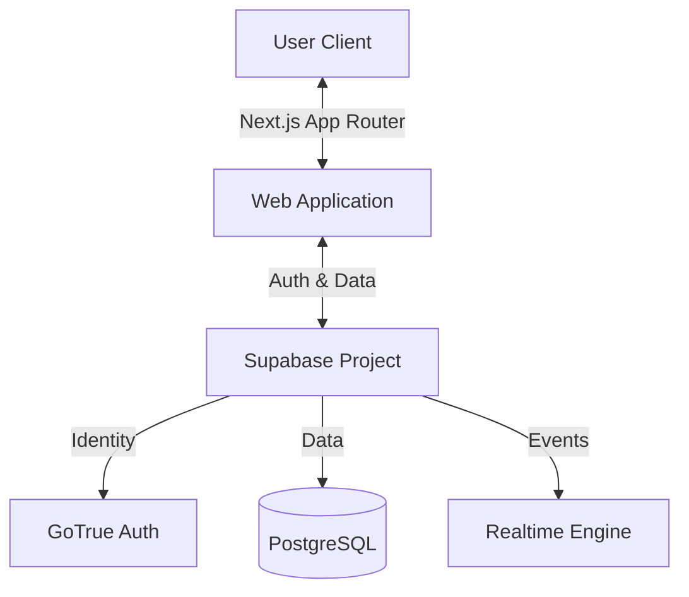

# Cipher - Secure Real-time Chat

Cipher is a secure, real-time messaging application built with Next.js and Supabase. It prioritizes user privacy by using Unique Codes for connection instead of phone numbers or email sharing.

## 🚀 Features

*   **Real-time Messaging**: Instant message delivery using Supabase Realtime.
*   **Unique Identity**: Connect with users via a unique 6-character code (e.g., `XC921A`).
*   **Secure Authentication**: Email/OTP login flow.
*   **Dark Mode**: Fully supported dark/light theme toggle.
*   **Responsive Design**: Mobile-first UI optimized for all devices.
*   **Chat Management**: Rename chats for better organization.

## 🛠 Tech Stack

*   **Frontend**: Next.js 14 (App Router), React, TypeScript
*   **Styling**: Tailwind CSS, Lucide Icons
*   **Backend**: Supabase (PostgreSQL, Authentication, Realtime)
*   **Deployment**: Vercel (Recommended)

## 📦 Installation

1.  **Clone the repository**
    ```bash
    git clone https://github.com/yourusername/cipher-next.git
    cd cipher-next
    ```

2.  **Install dependencies**
    ```bash
    npm install
    ```

3.  **Environment Setup**
    Create a `.env.local` file in the root directory:
    ```env
    NEXT_PUBLIC_SUPABASE_URL=your_supabase_url
    NEXT_PUBLIC_SUPABASE_ANON_KEY=your_supabase_anon_key
    ```

4.  **Run the development server**
    ```bash
    npm run dev
    ```

    Open [http://localhost:3000](http://localhost:3000) to view the app.

## 🏗 Architecture

See [docs/architecture.md](docs/architecture.md) for the full diagram.



## 📸 Screenshots

*(Add your screenshots here)*

## 📄 License

This project is licensed under the MIT License - see the [LICENSE](LICENSE) file for details.

## 👥 Team

*   [Your Name] - Lead Developer
