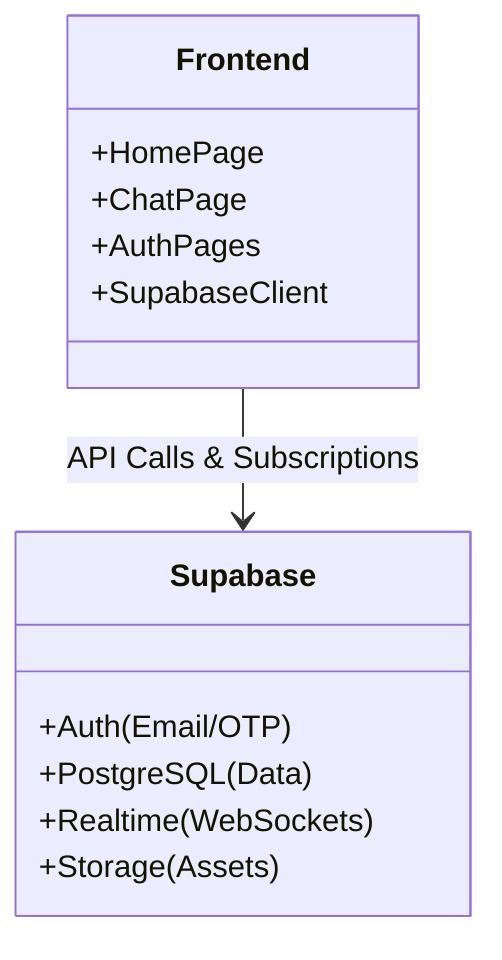

# Architecture Overview

## System Context

Cipher is a single-page application (SPA) built on Next.js that interacts directly with Supabase for all backend services.

## Component Diagram

## Database Schema

*   **profiles**: Users data (`id`, `email`, `unique_code`, `display_name`)
*   **chats**: Conversation metadata (`last_message`, `last_message_at`)
*   **chat_participants**: Join table (`chat_id`, `user_id`, `custom_chat_name`)
*   **messages**: Chat content (`id`, `chat_id`, `sender_id`, `content`)
